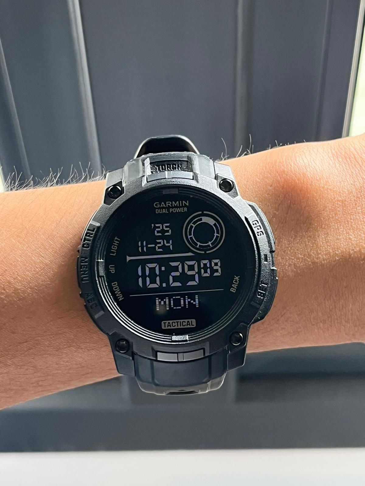

# *Byousoku*
## A watch face for the Garmin Instinct 3 45mm Tactical inspired by the watch worn by Toono Takaki in the film "5 Centimeters per Second".

<table style="border: none;">
  <tr>
    <td align="center" width="50%" style="border: none;">
      
    </td>
    <td align="center" width="50%" style="border: none;">
      
    </td>
  </tr>
</table>


## Requirements for Development (Not necessary for simply installing)

Before making changes to the watch face's source code, ensure you have:

- **Garmin Connect IQ SDK** - [Download here](https://developer.garmin.com/connect-iq/overview/)
- **Monkey C Language Support** - Usually through an extension for your IDE
- **Supported Device** - Garmin Instinct 3 Solar 45mm or compatible
- **Visual Studio Code** (Optional but recommended)
- **Connect IQ CLI Tools** - Included with SDK


## Installation

### Option 1: Install on Physical Device

#### Using File Manager (Drag & Drop)

1. **Connect your Garmin device** to your computer via USB
   - Your device will appear as a removable drive in your file manager
   - On Windows: Check "This PC" for a new drive (usually labeled "Garmin")
   - On macOS: Device appears on the Desktop and in Finder sidebar
   - On Linux: Device mounts to `/media/user/Garmin`

2. **Open your file manager** and navigate to the device
   - **Windows:** Open File Explorer, locate the GARMIN drive
   - **macOS:** Double-click the GARMIN icon on your Desktop
   - **Linux:** Open your file manager and navigate to the mounted device

3. **Locate the Apps folder:**
   - Navigate to: `Garmin` → `Apps`
   - If the APPS folder doesn't exist, create it

4. **Drag and drop the .prg file:**
   - Find `byousoku.prg` in the root of the project folder
   - Drag `byousoku.prg` directly into the `Garmin/Apps` folder
   - Wait for the copy operation to complete

5. **Safely eject your device:**
   - **Windows:** Right-click the Garmin drive → "Eject"
   - **macOS:** Drag Garmin icon to Trash, or right-click → "Eject"
   - **Linux:** Right-click mount point → "Unmount" or use `umount`
   - Your watch will sync automatically once disconnected

### Option 2: Install via Simulator (Development)

1. **Set up the Connect IQ SDK**

2. **Build the project:**
   ```bash
   cd byousoku
   monkeyc -o byousoku.prg -d instinct3solar45mm -z resources/strings/strings.xml -z resources/drawables/drawables.xml resources/
   ```

3. **Launch in simulator:**
   ```bash
   connectiq
   # Load the .prg file in the simulator
   ```

## Usage

Once installed on your Garmin Instinct 3 Solar:

1. **Long press** the UP button from the watch face
2. **Select** "Watch Faces"
3. **Find byousoku** in the list
4. **Press select** to activate
5. **Press back** to return to your new watch face


## Supported Devices

Currently optimized for:
- **Garmin Instinct 3 Solar 45mm** (Primary target)

Can be adapted for other Connect IQ devices by:
1. Modifying `monkey.jungle` product definitions
2. Adjusting font sizes and layout metrics
3. Updating `manifest.xml` minimum API level if needed